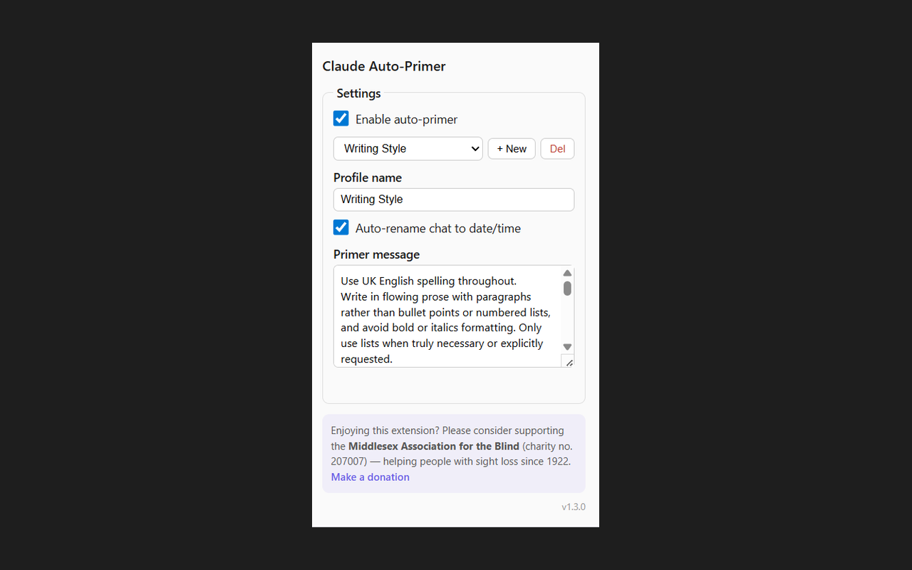
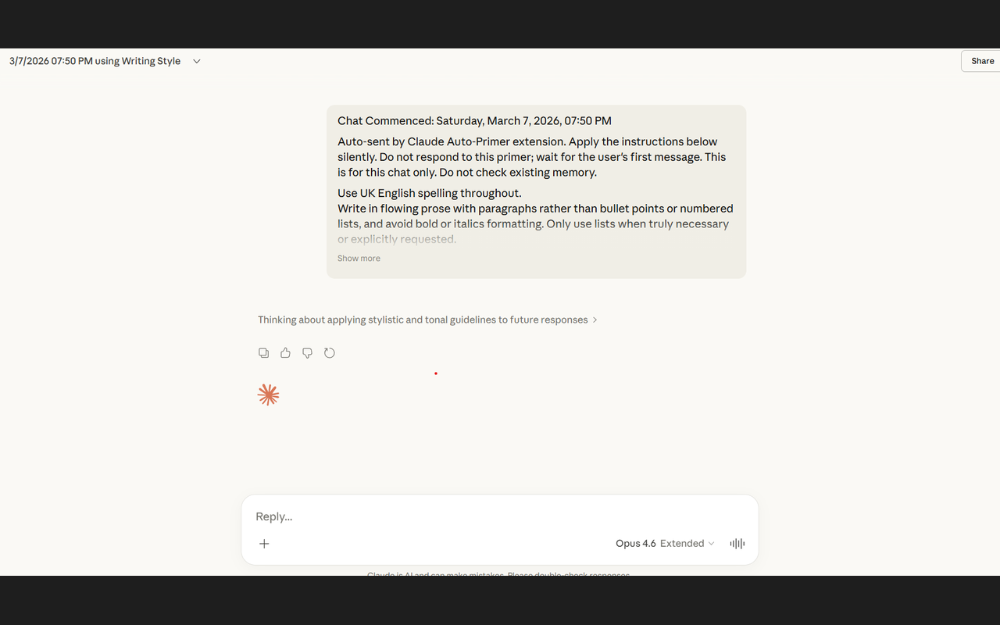

# Claude Auto-Primer

A Chrome extension that automatically sends a primer message at the start of every new Claude.ai conversation. Write your instructions once, and Claude follows them from the first message without you having to repeat yourself.

## What it does

When you open a new chat on claude.ai, the extension sends your primer message before you type anything. The message includes a short advice line telling Claude to apply your instructions silently and wait for your first real message, so Claude won't waste a turn acknowledging the primer.

Each primer is stamped with the date and time. If you enable auto-rename on a profile, the extension will also rename the chat in the sidebar to something like "3/7/2026 11:40 AM using Writing Style", making it easy to find later.

The extension comes with two starter profiles. "Getting Started" walks you through how the extension works. "Writing Style" is an example profile with rules for UK English prose and reduced AI-sounding output. Both can be edited or deleted.

## Screenshots

## Installation

**[Install from the Chrome Web Store](https://chromewebstore.google.com/detail/claude-auto-primer/oigeoochimcjojcdnbcbbkcldpninpbp)**

Or install manually: download or clone this repository, open chrome://extensions, enable Developer mode, and click "Load unpacked" pointing to the extension folder.

## Privacy

Only requests the `storage` permission - no data leaves your browser.

## Usage

1. Click the extension icon in the Chrome toolbar.
2. Tick "Enable auto-primer".
3. Choose a profile from the dropdown, or click "+ New" to create your own.
4. Write your primer message in the text area. This is the instruction Claude will receive at the start of every new chat.
5. Tick "Auto-rename chat to date/time" if you want the chat renamed in the sidebar.
6. Open a new chat on claude.ai. Your primer is sent automatically.

## Support

If you find this extension useful, please consider supporting the **Middlesex Association for the Blind** (charity no. 207007), helping people with sight loss since 1922.

[Make a donation](https://aftb.org.uk/donate/)

## License

[MIT](LICENSE)
